# modul praktikum 4: core components and styling

## tujuan pembelajaran
setelah menyiapkan praktikum ini mahasiswa mampu:
1. memahami dan menggunakan **16 core components** react native
2. menerapkan **stylesheet** untuk styling terpusat
3. menggunakan **useState** untuk state management dasar
4. membuat layout responsif dengan **flexbox**
5. menangani **interaksi pengguna** (tekan,inputscroll)

## praktikum ##

### langkah 1 : import library  and components ###
1. buka file app.js pada folder projek ptmn2
2. import library dan core 
3. konfirmasi bukti
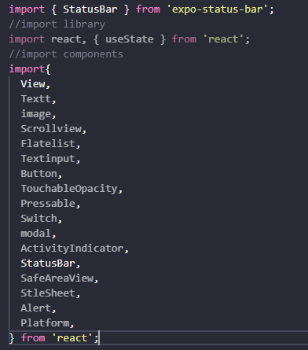

## langkah 2: menyiapkan array objek untuk menampung data ##
1. membuat array objek bernama PROFILE untuk menampung data profile
2 konfirmasi bukti

============================================
 DATA PROFIL (objek JavaScript)
============================================
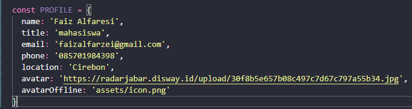

// ============================================
//  DATA SKILLS (array of objects)
//  → Akan ditampilkan dengan FlatList
// ============================================
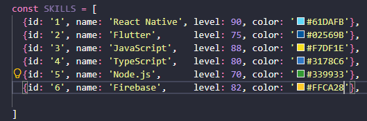

// ============================================
//  DATA RIWAYAT (sections)
//  → Akan ditampilkan dengan SectionList
// ============================================
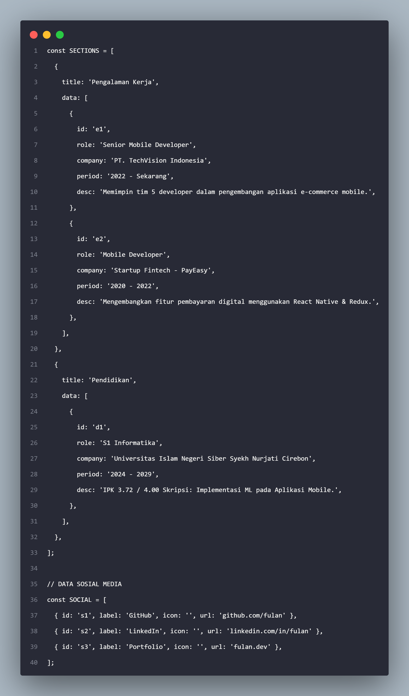

> [!NOTE]
> **Mengapa data di luar komponen?**  
> Data yang tidak berubah (statis) tidak perlu masuk ke dalam fungsi komponen agar tidak di-recreate setiap render.

## 📝 LANGKAH 3 — Sub-Components (SkillCard & TimelineCard)
**Konsep:** Komponen kecil yang bertugas merender satu item list. Ini adalah praktik **component reuse**.
Tambahkan kode berikut **di antara data dan fungsi App()**:
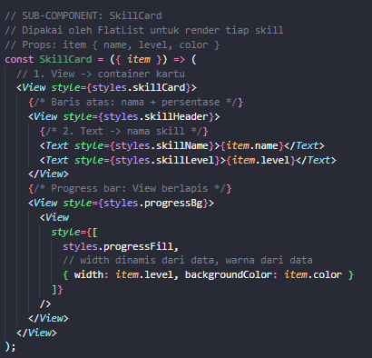
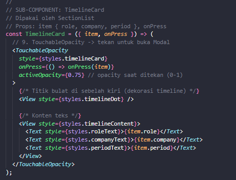

## 📝 LANGKAH 4 — State Management dengan useState
**Konsep:** `useState` menyimpan data yang bisa berubah. Setiap perubahan state akan men-trigger re-render komponen.
Tambahkan state di dalam fungsi `App()`:
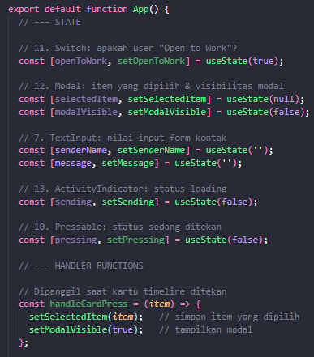
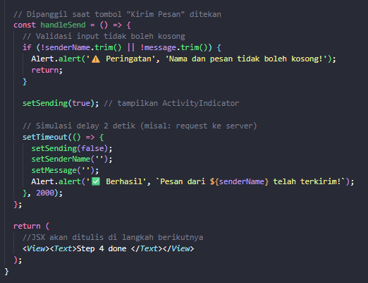

**✅ Checkpoint:** Aplikasi masih menampilkan teks, tidak ada error.

## 📝 LANGKAH 5 — SafeAreaView, StatusBar & Header
**Konsep:**
- `SafeAreaView` → memastikan konten tidak tertutup notch (takik kamera) atau home indicator
- `StatusBar` → mengatur tampilan bar di bagian atas perangkat
- `View` + `Switch` → membangun header bar
Ganti bagian `return (...)` di `App()`:
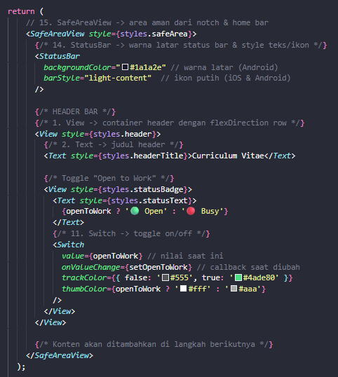

> [!TIP]
> `flexDirection: 'row'` membuat anak View tersusun **horizontal** (kiri ke kanan).  
> Default di React Native adalah `column` (atas ke bawah).
**✅ Checkpoint:** Header bar berwarna gelap dengan teks putih dan switch terlihat.

## 📝 LANGKAH 6 — ScrollView & Profil Section (View, Text,  img/image)
**Konsep:**
- `ScrollView` → membungkus konten panjang agar bisa di-scroll
- ` img/image` → menampilkan gambar dari URL (`source={{ uri: '...' }}`)
- `Text` → bisa di-styling dengan `style` prop seperti CSS

Ganti `<View><Text ...>Step 5</Text></View>` dengan:
{/* 4. ScrollView → semua konten CV dibungkus di sini */}
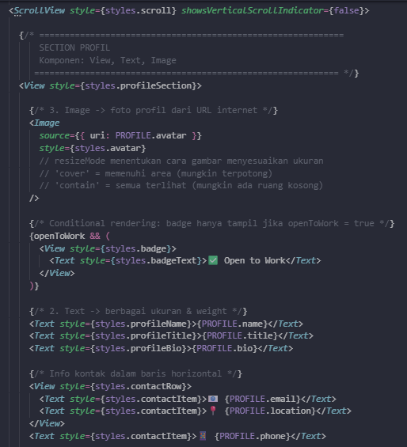
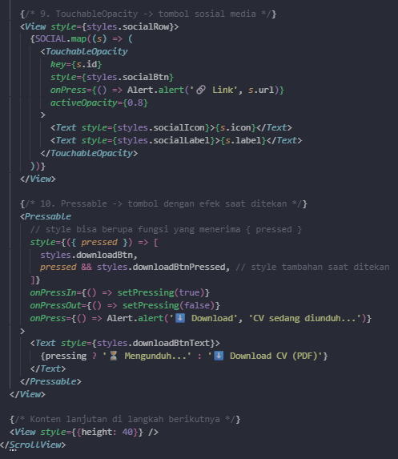

> [!NOTE]
> **Perbedaan `TouchableOpacity` vs `Pressable`:**
> - `TouchableOpacity` → sederhana, otomatis redup saat ditekan
> - `Pressable` → lebih fleksibel, kita kontrol sendiri style saat `pressed`

**✅ Checkpoint:** Foto profil, nama, jabatan, bio, dan tombol sosmed terlihat.

## 📝 LANGKAH 7 — FlatList (Daftar Skills)
**Konsep:** `FlatList` dioptimalkan untuk menampilkan daftar panjang — hanya item yang terlihat di layar yang di-render (lazy rendering / windowing).
Tambahkan kode berikut **di dalam** `<ScrollView>`, setelah section profil:
{/* ════════════════════════════════════
    SECTION SKILLS
    Komponen: FlatList
    ════════════════════════════════════ */}
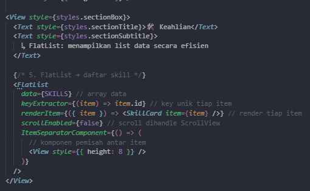

> [!TIP]
> **Props penting FlatList:**
> | Prop | Fungsi |
> |---|---|
> | `data` | Array sumber data |
> | `keyExtractor` | Fungsi penghasil key unik |
> | `renderItem` | Fungsi render tiap item |
> | `ItemSeparatorComponent` | Komponen pemisah antar item |
> | `ListHeaderComponent` | Komponen di atas list |
> | `ListFooterComponent` | Komponen di bawah list |
> | `numColumns` | Jumlah kolom (grid) |

**✅ Checkpoint:** Daftar skill dengan progress bar berwarna-warni terlihat.

## 📝 LANGKAH 8 — SectionList (Pengalaman & Pendidikan)
**Konsep:** `SectionList` seperti `FlatList` tetapi bisa mengelompokkan data berdasarkan section/kategori. Membutuhkan prop `sections` (bukan `data`) yang berisi array objek `{ title, data }`.
 
{/* ════════════════════════════════════
    SECTION RIWAYAT
    Komponen: SectionList
    ════════════════════════════════════ */}
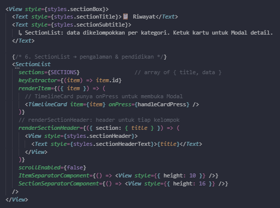

> [!NOTE]
> **Perbedaan FlatList vs SectionList:**
> | | FlatList | SectionList |
> |---|---|---|
> | Data | `data={array}` | `sections={[{title, data}]}` |
> | Header kelompok | Tidak ada | `renderSectionHeader` |
> | Penggunaan | List seragam | List berkategori |

**✅ Checkpoint:** Daftar pengalaman kerja & pendidikan terkelompok terlihat.

### hasil akhir ###