# modul praktikum 4: core components and styling

## tujuan pembelajaran
setelah menyiapkan praktikum ini mahasiswa mampu:
1. memahami dan menggunakan **16 core components** react native
2. menerapkan **stylesheet** untuk styling terpusat
3. menggunakan **useState** untuk state management dasar
4. membuat layout responsif dengan **flexbox**
5. menangani **interaksi pengguna** (tekan,inputscroll)

## praktikum ##

### langkah 1 : import library  and components ###
1. buka file app.js pada folder projek ptmn2
2. import library dan core 
3. konfirmasi bukti
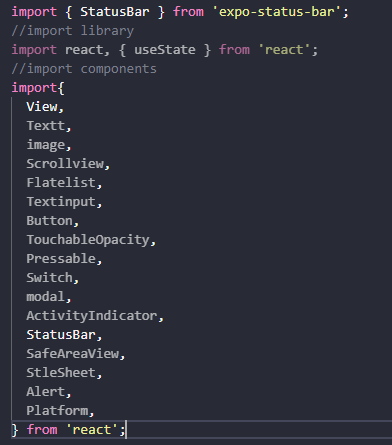

## langkah 2: menyiapkan array objek untuk menampung data ##
1. membuat array objek bernama PROFILE untuk menampung data profile
2 konfirmasi bukti

============================================
 DATA PROFIL (objek JavaScript)
============================================
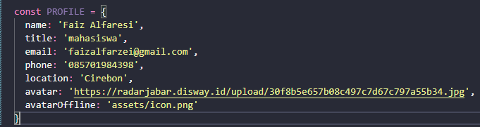

// ============================================
//  DATA SKILLS (array of objects)
//  → Akan ditampilkan dengan FlatList
// ============================================
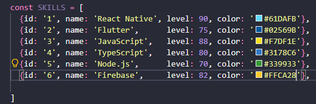

// ============================================
//  DATA RIWAYAT (sections)
//  → Akan ditampilkan dengan SectionList
// ============================================
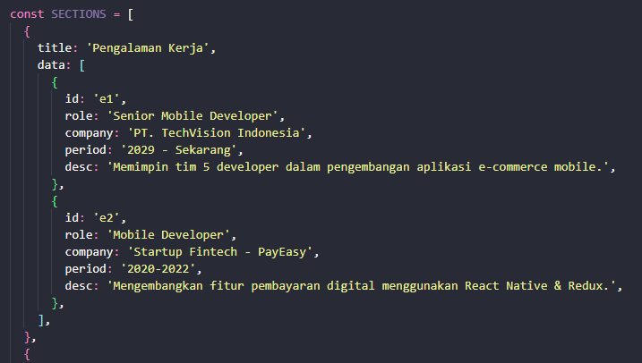

> [!NOTE]
> **Mengapa data di luar komponen?**  
> Data yang tidak berubah (statis) tidak perlu masuk ke dalam fungsi komponen agar tidak di-recreate setiap render.

## 📝 LANGKAH 3 — Sub-Components (SkillCard & TimelineCard)
**Konsep:** Komponen kecil yang bertugas merender satu item list. Ini adalah praktik **component reuse**.
Tambahkan kode berikut **di antara data dan fungsi App()**:
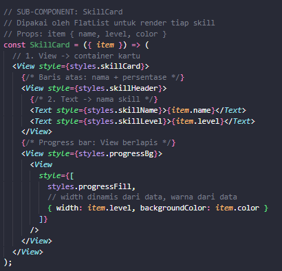
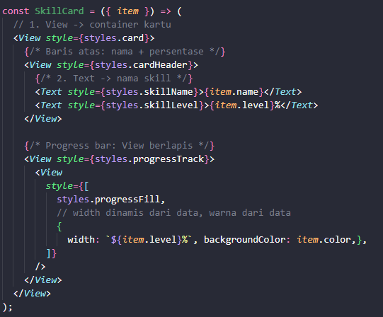

## 📝 LANGKAH 4 — State Management dengan useState
**Konsep:** `useState` menyimpan data yang bisa berubah. Setiap perubahan state akan men-trigger re-render komponen.
Tambahkan state di dalam fungsi `App()`:
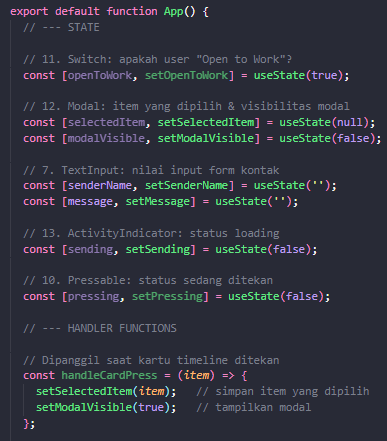
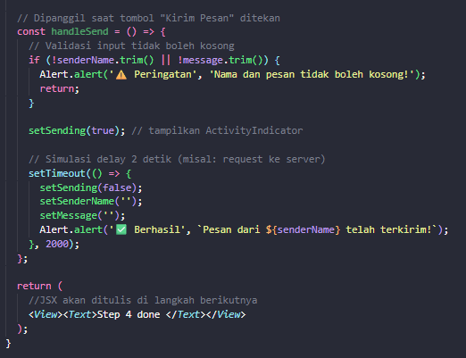

**✅ Checkpoint:** Aplikasi masih menampilkan teks, tidak ada error.

## 📝 LANGKAH 5 — SafeAreaView, StatusBar & Header
**Konsep:**
- `SafeAreaView` → memastikan konten tidak tertutup notch (takik kamera) atau home indicator
- `StatusBar` → mengatur tampilan bar di bagian atas perangkat
- `View` + `Switch` → membangun header bar
Ganti bagian `return (...)` di `App()`:
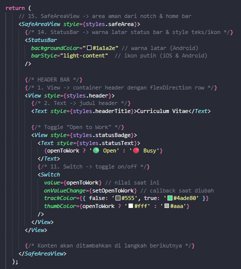

> [!TIP]
> `flexDirection: 'row'` membuat anak View tersusun **horizontal** (kiri ke kanan).  
> Default di React Native adalah `column` (atas ke bawah).
**✅ Checkpoint:** Header bar berwarna gelap dengan teks putih dan switch terlihat.

## 📝 LANGKAH 6 — ScrollView & Profil Section (View, Text,  img/image)
**Konsep:**
- `ScrollView` → membungkus konten panjang agar bisa di-scroll
- ` img/image` → menampilkan gambar dari URL (`source={{ uri: '...' }}`)
- `Text` → bisa di-styling dengan `style` prop seperti CSS

Ganti `<View><Text ...>Step 5</Text></View>` dengan:
{/* 4. ScrollView → semua konten CV dibungkus di sini */}
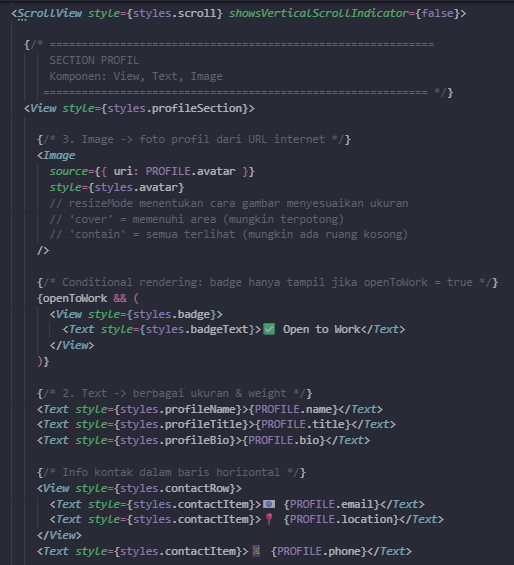
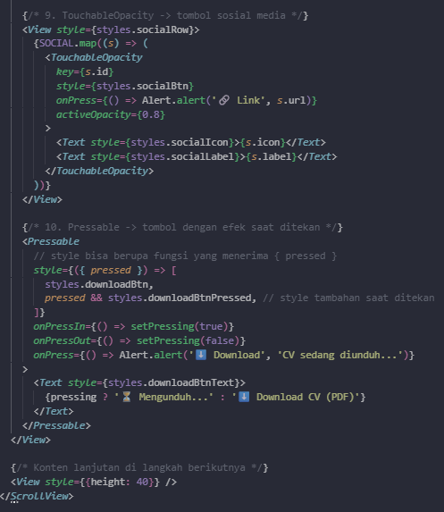

> [!NOTE]
> **Perbedaan `TouchableOpacity` vs `Pressable`:**
> - `TouchableOpacity` → sederhana, otomatis redup saat ditekan
> - `Pressable` → lebih fleksibel, kita kontrol sendiri style saat `pressed`

**✅ Checkpoint:** Foto profil, nama, jabatan, bio, dan tombol sosmed terlihat.

## 📝 LANGKAH 7 — FlatList (Daftar Skills)
**Konsep:** `FlatList` dioptimalkan untuk menampilkan daftar panjang — hanya item yang terlihat di layar yang di-render (lazy rendering / windowing).
Tambahkan kode berikut **di dalam** `<ScrollView>`, setelah section profil:
{/* ════════════════════════════════════
    SECTION SKILLS
    Komponen: FlatList
    ════════════════════════════════════ */}
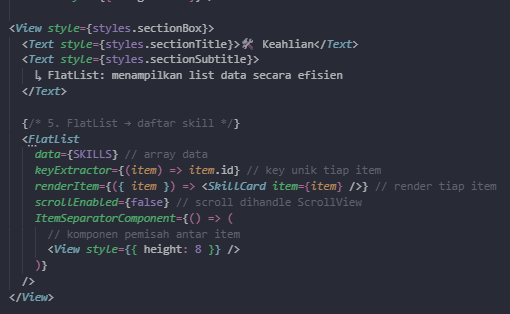

> [!TIP]
> **Props penting FlatList:**
> | Prop | Fungsi |
> |---|---|
> | `data` | Array sumber data |
> | `keyExtractor` | Fungsi penghasil key unik |
> | `renderItem` | Fungsi render tiap item |
> | `ItemSeparatorComponent` | Komponen pemisah antar item |
> | `ListHeaderComponent` | Komponen di atas list |
> | `ListFooterComponent` | Komponen di bawah list |
> | `numColumns` | Jumlah kolom (grid) |

**✅ Checkpoint:** Daftar skill dengan progress bar berwarna-warni terlihat.

## 📝 LANGKAH 8 — SectionList (Pengalaman & Pendidikan)
**Konsep:** `SectionList` seperti `FlatList` tetapi bisa mengelompokkan data berdasarkan section/kategori. Membutuhkan prop `sections` (bukan `data`) yang berisi array objek `{ title, data }`.
 
{/* ════════════════════════════════════
    SECTION RIWAYAT
    Komponen: SectionList
    ════════════════════════════════════ */}
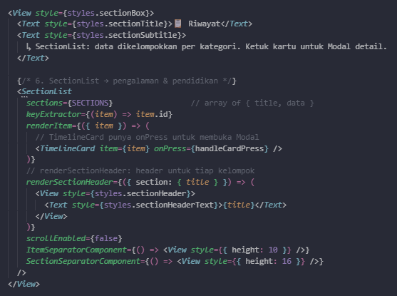

> [!NOTE]
> **Perbedaan FlatList vs SectionList:**
> | | FlatList | SectionList |
> |---|---|---|
> | Data | `data={array}` | `sections={[{title, data}]}` |
> | Header kelompok | Tidak ada | `renderSectionHeader` |
> | Penggunaan | List seragam | List berkategori |

**✅ Checkpoint:** Daftar pengalaman kerja & pendidikan terkelompok terlihat.

## 📝 LANGKAH 9 — TextInput, Button & ActivityIndicator
**Konsep:**
- `TextInput` → input teks. `value` + `onChangeText` = controlled component
- `Button` → tombol paling sederhana di React Native
- `ActivityIndicator` → spinner loading

{/* ════════════════════════════════════
    SECTION FORM KONTAK
    Komponen: TextInput, Button, ActivityIndicator
    ════════════════════════════════════ */}
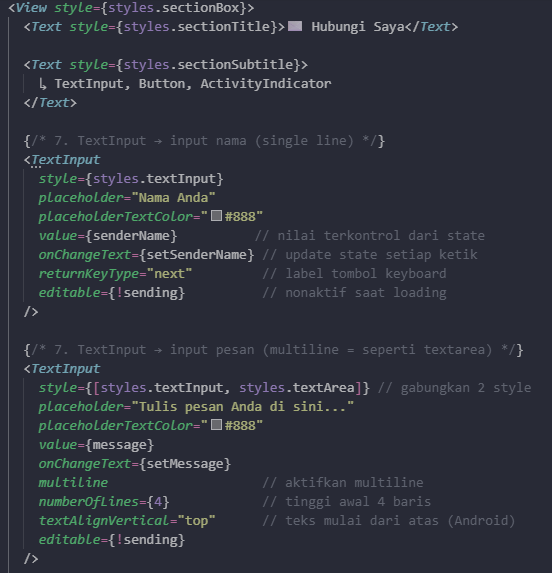
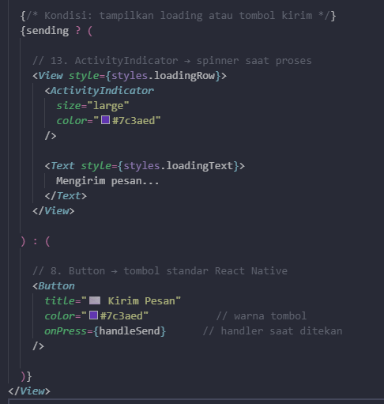

> [!TIP]
> **Controlled vs Uncontrolled Component:**
> - **Controlled:** `value={state}` + `onChangeText={setState}` → nilai input selalu sesuai state
> - **Uncontrolled:** hanya pakai `ref` → tidak direkomendasikan di React

**✅ Checkpoint:** Form input nama & pesan berfungsi. Tekan "Kirim Pesan" → loading 2 detik → Alert sukses.

## 📝 LANGKAH 10 — Modal (Popup Detail)
**Konsep:** `Modal` menampilkan konten di atas (overlay) tampilan saat ini. Dikendalikan dengan prop `visible`.
Tambahkan **setelah** penutup `</ScrollView>` dan sebelum `</SafeAreaView>`:
{/* ════════════════════════════════════
    12. MODAL → popup detail riwayat
    ════════════════════════════════════ */}
 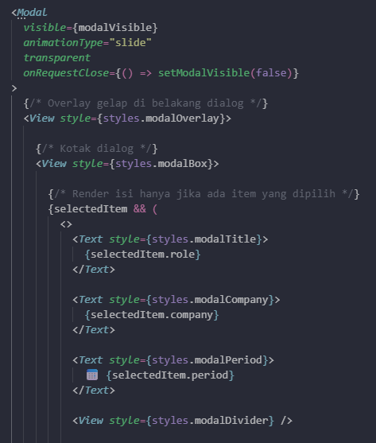
 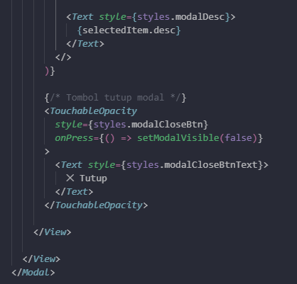

> [!NOTE]
> **Props Modal:**
> | Prop | Nilai | Fungsi |
> |---|---|---|
> | `visible` | `true`/`false` | Tampilkan/sembunyikan |
> | `animationType` | `'slide'`, `'fade'`, `'none'` | Animasi kemunculan |
> | `transparent` | `true`/`false` | Latar transparan |
> | `onRequestClose` | fungsi | Tombol back Android |

**✅ Checkpoint:** Ketuk kartu riwayat → modal muncul dari bawah → tombol Tutup menutup modal.

## 📝 LANGKAH 11 — StyleSheet (Styling Terpusat)

**Konsep:** `StyleSheet.create()` adalah cara resmi styling di React Native. Mirip CSS tetapi menggunakan JavaScript object dengan properti camelCase.

Tambahkan kode berikut di **bawah** fungsi `App()` (paling bawah file):

// ============================================
//  PALET WARNA (konstanta warna terpusat)
// ============================================
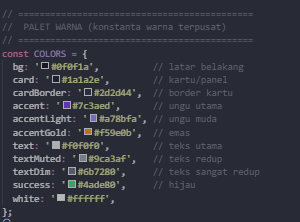

// ============================================
//  16. StyleSheet.create() → semua style
// ============================================
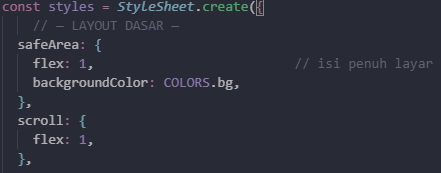

  // ── HEADER BAR ────────────────────────────
  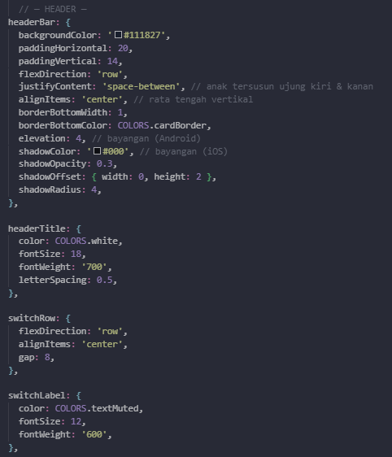

  // ── SECTION PROFIL ─────────────────────────
  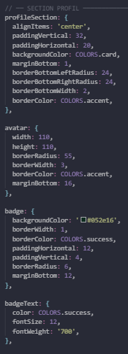
  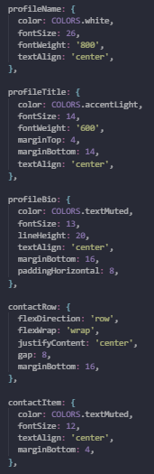

  // ── SOSIAL MEDIA ───────────────────────────
  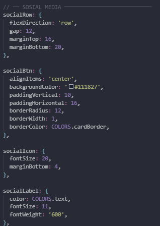

  // ── PRESSABLE DOWNLOAD ─────────────────────
  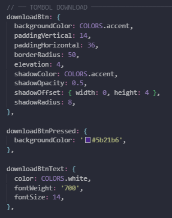

  // ── SECTION BOX (wrapper kartu) ────────────
  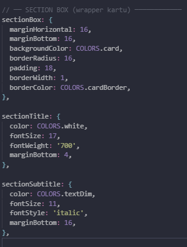

  // ── SECTION LIST HEADER ────────────────────
  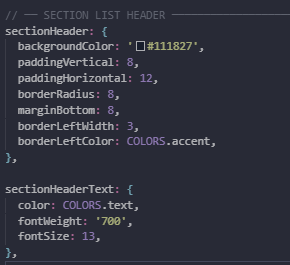

  // ── SKILL CARD ─────────────────────────────
  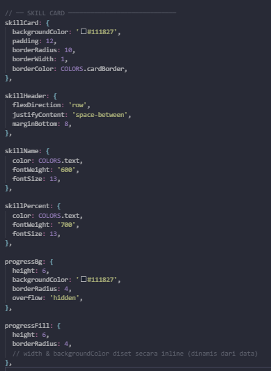

  // ── TIMELINE CARD ──────────────────────────
  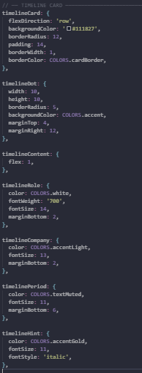

  // ── TEXT INPUT ─────────────────────────────
  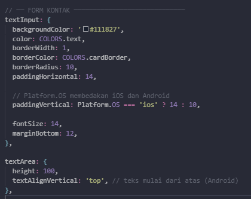

  // ── LOADING ROW ────────────────────────────
  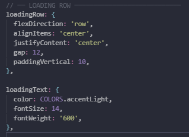

  // ── MODAL ──────────────────────────────────
  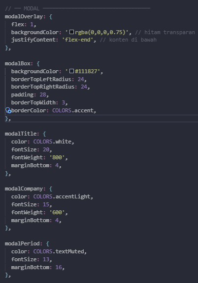
  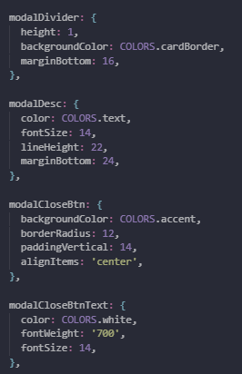

## ✅ LANGKAH 12 — Verifikasi & Pengujian

Jalankan aplikasi dan pastikan semua fitur bekerja:

| # | Yang Diuji | Hasil yang Diharapkan |
|---|---|---|
| 1 | Aplikasi bisa dibuka | Layar CV tampil tanpa error |
| 2 | Foto profil tampil | Gambar dari URL terload |
| 3 | Halaman bisa di-scroll | Semua section bisa diakses |
| 4 | Toggle Switch | Badge "Open to Work" muncul/hilang |
| 5 | Progress bar skill | Bar berwarna sesuai persentase |
| 6 | Ketuk kartu riwayat | Modal popup muncul dari bawah |
| 7 | Tombol Tutup di Modal | Modal tertutup |
| 8 | Isi form & kirim | Loading 2 detik → Alert sukses |
| 9 | Kirim dengan input kosong | Alert peringatan muncul |
| 10 | Tekan Download CV | Efek visual berubah + Alert |
| 11 | Tap tombol sosmed | Alert URL muncul |

---

## 🧠 Konsep Styling yang Perlu Dipahami

### Flexbox di React Native

 
┌─────────────────────────┐
│  flexDirection: 'column'│  ← DEFAULT
│  ┌───┐                  │
│  │ A │                  │  Anak tersusun
│  ├───┤                  │  dari ATAS ke BAWAH
│  │ B │                  │
│  └───┘                  │
└─────────────────────────┘

┌─────────────────────────┐
│  flexDirection: 'row'   │
│  ┌───┬───┐              │  Anak tersusun
│  │ A │ B │              │  dari KIRI ke KANAN
│  └───┴───┘              │
└─────────────────────────┘
 

### Satuan Ukuran

Di React Native **tidak ada unit** seperti `px`, `em`, `%`. Semua angka adalah **density-independent pixels (dp)**.

 
// Benar ✅
width: 100       // 100dp

// Salah ❌
width: '100px'   // tidak valid
 

Pengecualian: `width` dan `height` bisa menerima string persentase:
 
width: '50%'    // 50% dari parent
 

### StyleSheet vs Inline Style

 
// ✅ Direkomendasikan: StyleSheet.create()
<View style={styles.container}>

// ⚠️ Boleh tetapi kurang optimal: inline object
<View style={{ flex: 1, backgroundColor: 'red' }}>

// ✅ Boleh: gabung keduanya dengan array
<View style={[styles.container, styles.active]}>
 

---

## 🏆 Tugas / Latihan

> [!IMPORTANT]
> Selesaikan semua tugas berikut dan kumpulkan file `App.js` beserta screenshot aplikasi.

### Tugas Wajib (Nilai 70)
1. **Ganti data profil** dengan data pribadi Anda (nama, email, foto, dll)
2. **Tambah minimal 3 skill** baru dengan warna berbeda
3. **Tambah 1 pengalaman kerja/organisasi** dan **1 riwayat pendidikan** baru

### Tugas Pengembangan (Nilai 30)
4. **Tambah komponen `KeyboardAvoidingView`** agar form tidak tertutup keyboard
5. **Buat tab navigasi sederhana** (Info / Skills / Kontak) menggunakan `TouchableOpacity`
6. **Tambah animasi** pada profile avatar menggunakan `Animated` API

---

## 📚 Referensi

| Sumber | Link |
|---|---|
| Dokumentasi Resmi React Native | https://reactnative.dev/docs/components-and-apis |
| Expo Documentation | https://docs.expo.dev |
| React Native StyleSheet | https://reactnative.dev/docs/stylesheet |
| Flexbox di React Native | https://reactnative.dev/docs/flexbox |

---

*Modul Praktikum — Pemrograman Mobile · Pertemuan: Core Components & Styling*

