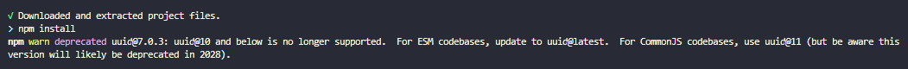
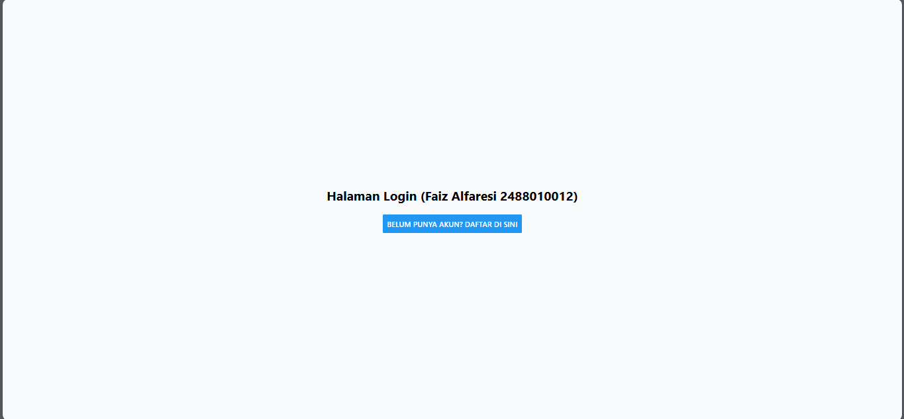
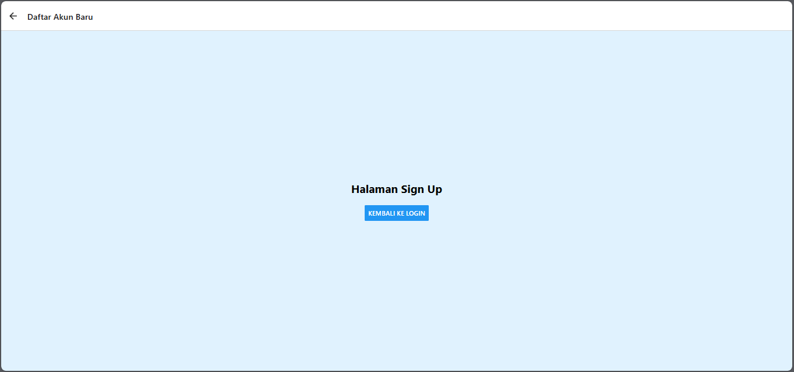

### NAVIGATION in REACT NATIVE ###

### TUJUAN PEMBELAJARAN ###
setelah mengikuti praktikum ini, mahasiswa diharapkan mampu:
1. menggunakan navigasi antar halaman menggunakan komponen navigation pada React Native
2. menggunkana props untuk mengirimkan data antar halaman
3. membuat navigasi dengan stack, tab dan drevar navigation

### langkah praktikum ###
### langkah 1: persiapan projek navigasi ###
1. membuat projek baru bernama ptmn4 (npx create-expo-app ptmn4 --template blank)
2. change directory ke ptmn4

3. instal core navigation library (npm install @react-navigation/native)
4. install depedensi pendukung (wajib untuk expo) (npx expo install react-native-screens react-native-safe-area-context react-native-gesture-handler react-native-reanimated)

### langkah 2: membuat stack navigation ###
1. install library untuk navigation stack (npm install @react-navigation/native-stack)
2. buat folder screens
3. buat file Login.js dan Signup.js di folder screens
4. sesuaikan isi file app.js dengan yang ada dimodul
5. install untuk web emulator (npx expo install react-dom react-native-web)
6. npx expo start --web
7. konfirmasi bukti

